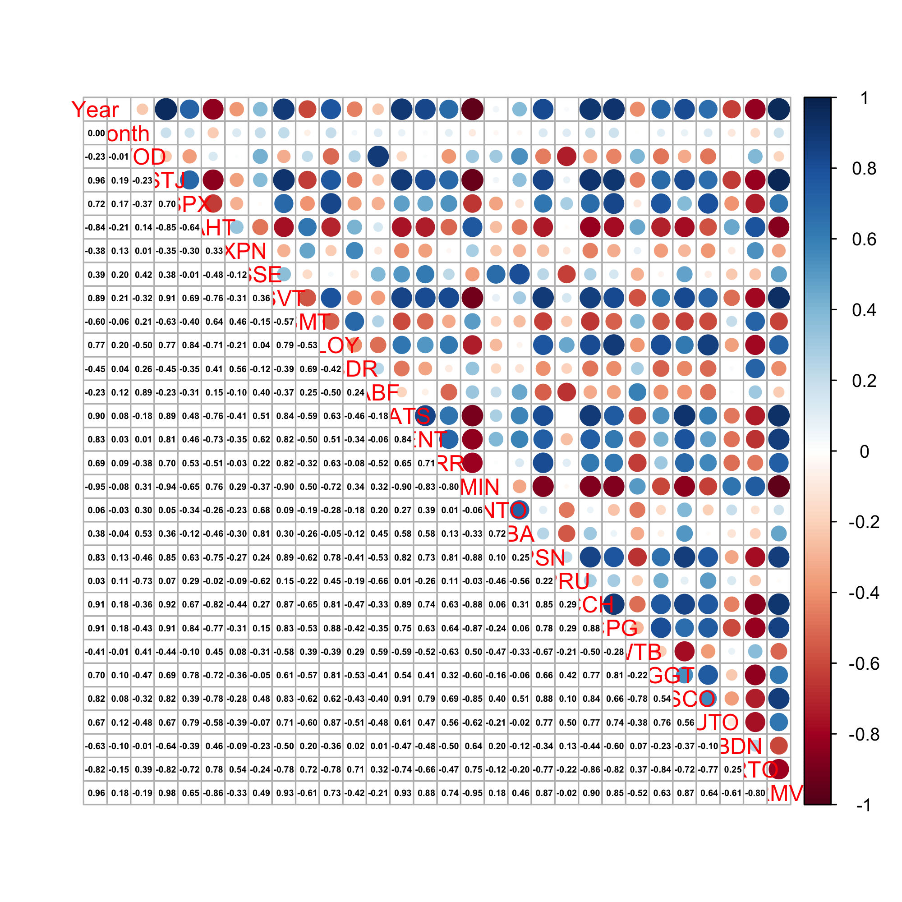
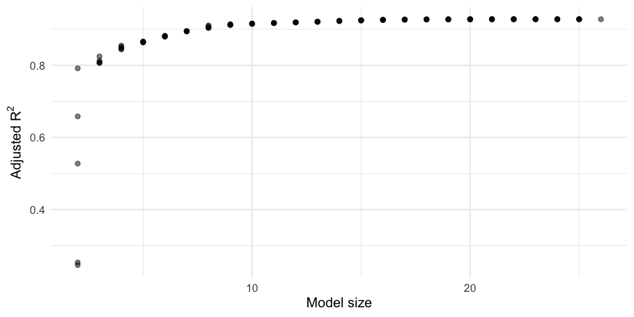
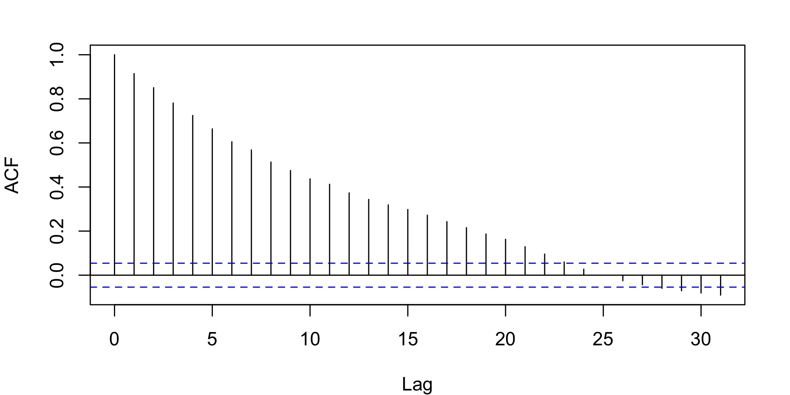

# LSE stock-price regression and variable selection (R)

A multiple-linear-regression study that builds an explanatory model for
Vodafone's share price (VOD) using a basket of other LSE-listed stocks as
predictors. The focus is on the variable-selection workflow: screening for
multicollinearity, applying leaps/stepwise/forward/backward selection,
Box-Cox response transforms, and residual diagnostics.

Despite the repo name, this is **not** a time-series forecasting project — it
is an explanatory regression study. The original 2023 coursework used an LSE
basket supplied with the assignment; that file is no longer available, so the
analysis now runs on a clearly-labelled synthetic dataset with the same
schema.

## What's here

```
.
├── report/
│   └── stock-regression-analysis.Rmd   # main write-up (renders to PDF)
├── R/
│   └── stock-regression-analysis.R     # same analysis as a sourced script
├── data/
│   ├── generate_demo_data.R            # generate the synthetic lse dataset
│   └── README.md                       # synthetic-data notes + schema
└── output/
    ├── stock-regression-analysis.pdf   # rendered report
    └── figures/                        # key charts exported as PNG
```

## Quick start

```bash
# R 4.x with: install.packages(c("car","leaps","MASS","corrplot","GGally","ggpubr","broom","tidyverse","rmarkdown"))
Rscript data/generate_demo_data.R                                    # one-off data generation
Rscript -e 'rmarkdown::render("report/stock-regression-analysis.Rmd")'
open output/stock-regression-analysis.pdf
```

## What the analysis covers

1. **Multicollinearity screening** — correlation matrix, scatterplot
   inspection, pruning of redundant predictors (`EXPN`, `SVT`, `SMT`, `Year`).
2. **Transformations** — log transforms on `SSE`, `LLOY`, `ABF` to linearise
   their relationship with VOD.
3. **Variable selection** — leaps-and-bounds, stepwise (both), forward, and
   backward selection compared head-to-head.
4. **Response transforms** — Box-Cox identifies $\lambda \approx 2.6$–$2.8$
   on VOD; the selection process is re-run on the transformed response.
5. **Residual diagnostics** — the standard `lm` plot panel, residual ACF,
   and PRESS statistic.

### Headline figures







## A key caveat

The residuals are strongly autocorrelated, which is the expected consequence
of fitting OLS to price levels. The in-sample fit numbers look impressive
(adj-$R^2 \approx 0.91$) but the standard errors are underestimated. A proper
analysis would model returns (or log-returns) directly, or use an ARIMAX /
dynamic regression. This project documents the workflow rather than claiming
a real forecasting result.

## Bug fixes vs. the original draft

| # | Original | Fixed |
|---|----------|-------|
| 1 | Backward fit referenced `data = lsenew4` inside the `subset()` call that defined `lsenew4` (lazy-eval quirk) | Build the data frame first, then fit |
| 2 | `for (i in x){ x <- c(...) }` reassigned the loop variable inside its own body | Plain `for (v in candidate_vars)` loop |
| 3 | Hard-coded column indices `lsenew[,-c(2,8,13,15)]` left undocumented | Annotated in comments |

## Disclaimer

This is a learning exercise. Nothing here is investment advice.
